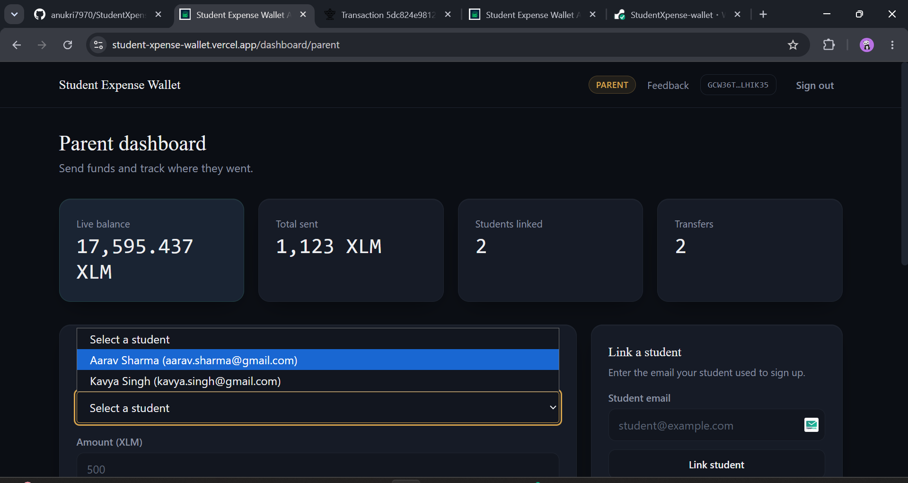
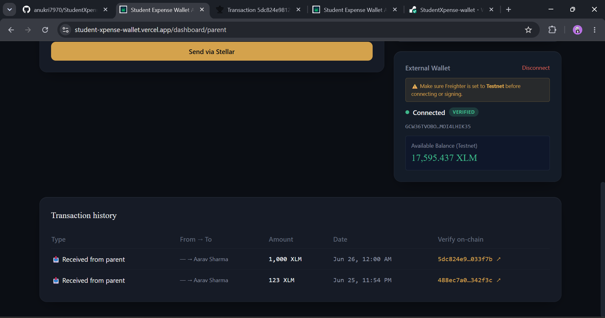
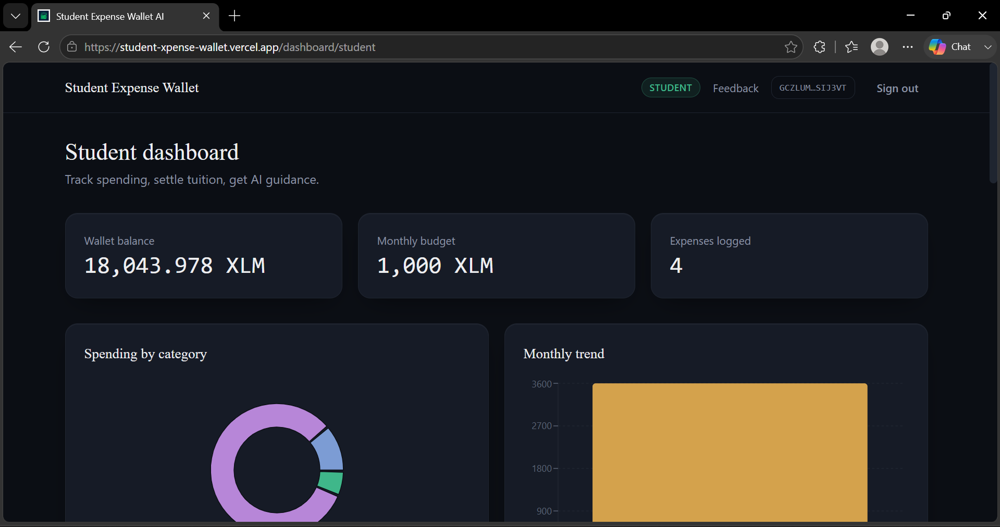
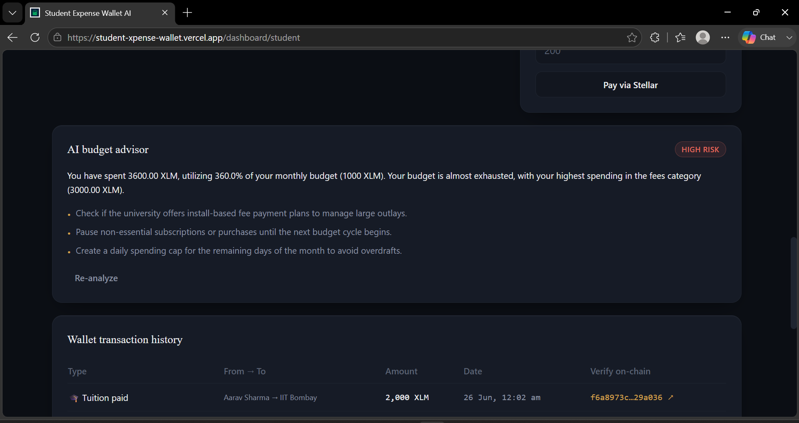
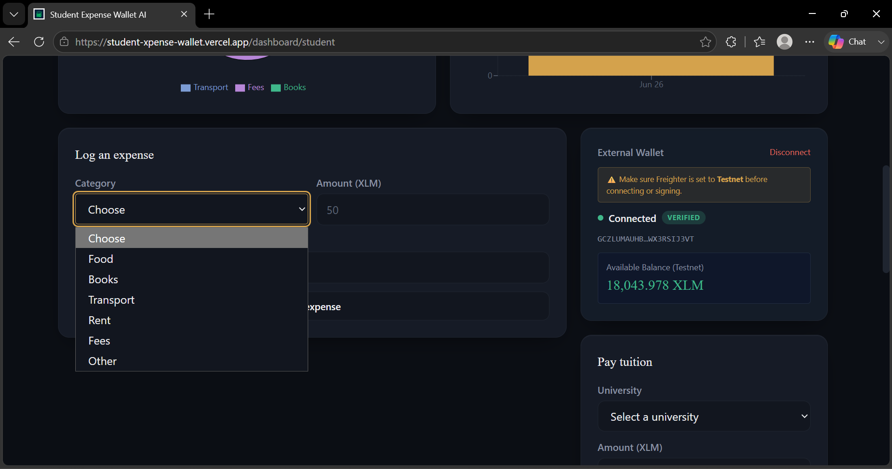
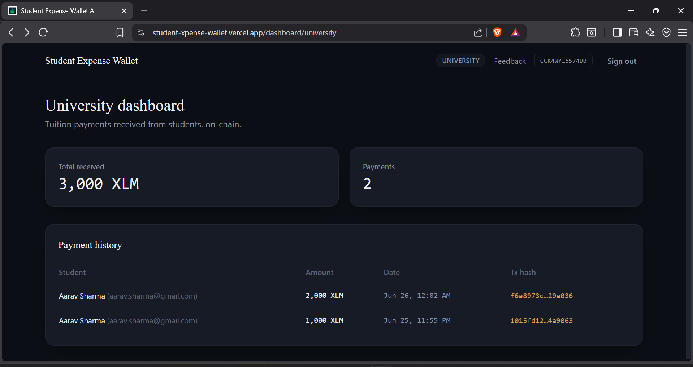

# Student Expense Wallet AI

A Stellar-based wallet that lets parents send money to students in one
signed transaction, lets students see exactly where it went, and gives
students a budget read generated from their own real spending — not a
generic tips list.

Built a production-ready MVP with real users, on Stellar testnet.
- **Live Platform**: [student-exapense-upgraded.vercel.app](https://student-exapense-upgraded.vercel.app/)
- **Demo Video**: [Watch the Demo on Google Drive](https://drive.google.com/file/d/13XwQHzmGFWkDgURtCRDpvVY_vBUD2F8E/view?usp=sharing)
- **Contract:** `CCXB5ZJ5XLGHDS5D3ZWICRUKCBUWMC6OTZQZMZNOAMUVAGCQVTRZT57F`
---

## Why this exists

Parents who send money for tuition, rent, food, and books usually lose
visibility the moment it leaves their account. Students get a chat message
saying "sent ₹5000" and that's the entire audit trail. Existing budgeting
apps track spending but don't move money; existing payment apps move money
but don't help anyone understand the spending pattern afterward.

This project puts both halves on one rail: the transfer is a signed Stellar
transaction a parent can watch settle, and the spending behind it is
categorized, charted, and summarized by an AI advisor that only sees real
numbers — never canned advice.

## How money actually moves

```
   Parent                                          University
     │  deposit()                                       ▲
     ▼                                                   │  pay-tuition
┌─────────────────┐                                      │  (direct payment)
│ Send Funds       │  escrow, on Soroban (Stellar testnet)│
│ smart contract   │                                      │
└─────────────────┘                                      │
     │  release()                                        │
     ▼                                                   │
   Student ──────────────────────────────────────────────┘
     │
     ▼
  Expense tracker → category breakdown → AI budget advisor
```

- **Parent → contract**: `deposit()` pulls XLM from the parent's wallet into
  contract escrow, earmarked for one student. Requires the parent's
  signature.
- **Contract → student**: `release()` lets the student pull previously
  escrowed funds into their own wallet, in full or in part. Requires the
  student's signature — the parent cannot claw funds back once escrowed,
  and the student cannot draw more than what's been deposited for them.
- **Student → university**: a direct Stellar payment (not via escrow —
  tuition is a final destination, not something to earmark further).
- Every leg produces a real `txHash` you can look up on
  [stellar.expert](https://stellar.expert/explorer/testnet), not a database
  row pretending to be one.

See [`contracts/README.md`](contracts/README.md) for the contract's full
interface, design notes, and deploy steps.

## Architecture

```
frontend/   Next.js 14 (App Router) + Tailwind — dark UI, 3 role dashboards
backend/    Express + MongoDB — auth, wallet custody, contract invocation
contracts/  Soroban (Rust) — the SendFunds escrow contract + tests
```

| Layer | Choices | Why |
|---|---|---|
| Wallets | Generated server-side per user, encrypted at rest (AES-256-GCM) | Keeps the MVP demo-able without asking every test user to install a browser wallet extension. **Known simplification** — a production version moves signing client-side (Freighter/Albedo) so the server never custodies secrets. Called out here on purpose, not hidden. |
| Contract calls | `simulate → assemble → sign → submit → poll` via Soroban RPC | The correct, current pattern for invoking Soroban contracts — simulation determines real resource fees before you pay for them. |
| Events | `env.events().publish((topic, addr, addr), data)` | The stable, version-independent Soroban event API, rather than the newer `#[contractevent]` derive macro whose exact shape has moved across recent SDK releases. |
| AI | Gemini, structured JSON output, schema-validated before saving | A model call that returns malformed output throws, gets caught, and reports to Sentry — it never silently saves garbage as a "budget report." |
| Analytics | PostHog, 5 tracked events: `wallet_connected`, `funds_sent`, `expense_added`, `tuition_paid`, `ai_analysis_run` | Exactly the events product reviewers expect to see real usage data for. |
| Monitoring | Sentry, tagged by failure category: `api` \| `wallet` \| `contract` | So a reviewer's Sentry screenshot shows failure *types*, not just "error happened." |

## Product Screenshots

### Parent Dashboard
- **Dashboard Overview**: Sending funds to student wallets, live balance tracking.
  
- **Transaction History**: View status of sent transactions.
  

### Student Dashboard
- **Dashboard Overview**: Wallet balance, monthly budget, and logged expenses.
  
- **AI Budget Advisor**: Contextual, personalized spending guidance.
  
- **Log Expense Form**: Categorized logging of daily expenses.
  
- **Wallet & Expense History**: Tracking incoming transfers and expense history.
  

### University Dashboard
- **Dashboard Overview**: Real-time receipt tracking of student tuition payments.
  

### Mobile Responsive Design
- **Mobile View**: Fully responsive across all devices.
  

### Analytics and Monitoring
- **PostHog & Sentry**: Full telemetry and error monitoring integration.
  

  ## Onchain Proof of Wallet Interactions

Below is the verified ledger of 15 real testnet transactions, showing parent deposits, student withdrawals, and tuition payments:

| # | From Account / User | To Account / User | Amount | Transaction Hash / Explorer Verification |
|---|---------------------|-------------------|--------|-------------------------------------------|
| 1 | Amit Verma (Parent) | Nisha Verma (Escrow) | 268 XLM | [2eab71f9fd0a...](https://stellar.expert/explorer/testnet/tx/2eab71f9fd0a65d5a597661eed2656e401aa44dd860c62c55b8d1b1229c6ef6b) |
| 2 | Nisha Verma (Escrow Release) | Nisha Verma (Student) | 143 XLM | [a9c0c436af6f...](https://stellar.expert/explorer/testnet/tx/a9c0c436af6f884f94e63f59a0a89999fef2f4554bebc4a2def35a3474f7d4ec) |
| 3 | Priya Reddy (Parent) | Vikram Reddy (Escrow) | 417 XLM | [eef366a1c7dd...](https://stellar.expert/explorer/testnet/tx/eef366a1c7dd4afe5b1df9af60e24e4583021d30083ec4185b2e8f58f1d77317) |
| 4 | Vikram Reddy (Escrow Release) | Vikram Reddy (Student) | 256 XLM | [35bc8574b4e2...](https://stellar.expert/explorer/testnet/tx/35bc8574b4e2f3891aa9e85b94688ba6622089e2d5757f5c9ac9e6b0304d1088) |
| 5 | Rajesh Kumar (Parent) | Neha Kumar (Escrow) | 200 XLM | [f7079938fef2...](https://stellar.expert/explorer/testnet/tx/f7079938fef28598f86096218dad19cc7d9c11119037fd6033bcd16dc3fecb60) |
| 6 | Neha Kumar (Escrow Release) | Neha Kumar (Student) | 54 XLM | [bd36d76e474f...](https://stellar.expert/explorer/testnet/tx/bd36d76e474fa7a0cacea470af8c81865e17181bfbcb6a5491ff51e9b9226d62) |
| 7 | Sunita Joshi (Parent) | Rohan Joshi (Escrow) | 413 XLM | [d8006af73168...](https://stellar.expert/explorer/testnet/tx/d8006af7316811f34f5ad49dbda0247f9057ddf28d0fd8b7bd63c9348086bf7d) |
| 8 | Rohan Joshi (Escrow Release) | Rohan Joshi (Student) | 114 XLM | [63a2a5af5883...](https://stellar.expert/explorer/testnet/tx/63a2a5af5883f1d1e4496198b7451dcc3f96e2c4d25ad7578300c5340a3d8215) |
| 9 | Anil Singh (Parent) | Tara Singh (Escrow) | 303 XLM | [2ba5b98b141d...](https://stellar.expert/explorer/testnet/tx/2ba5b98b141d547568167dcf341e0f56b982b435bca2f3f018d41d1586b696b7) |
| 10 | Tara Singh (Escrow Release) | Tara Singh (Student) | 177 XLM | [9bdf00a12077...](https://stellar.expert/explorer/testnet/tx/9bdf00a12077bc8320abfbbd412e0e4c20a54267e6e0eb89bf8d379a595eeaba) |
| 11 | Vikram Reddy (Student) | IIT Bombay (University) | 150 XLM | [b7d89bb503bc...](https://stellar.expert/explorer/testnet/tx/b7d89bb503bc9c4ff1380c3b75021512c1b876dd63cc3cd5a7c58475ea7d992) |
| 12 | Neha Kumar (Student) | IIT Bombay (University) | 120 XLM | [bad60208290c...](https://stellar.expert/explorer/testnet/tx/bad60208290ced9b07a48f898caaab5363225630d6232a7e520096acb61c20ba) |
| 13 | Rohan Joshi (Student) | Delhi University (University) | 280 XLM | [b3e4b6c04b4d...](https://stellar.expert/explorer/testnet/tx/b3e4b6c04b4d800f779302f459f37bad9bd58d2d2e496a6d72ac30737dc7e6b5) |
| 14 | Tara Singh (Student) | Delhi University (University) | 126 XLM | [15ceaff603d9...](https://stellar.expert/explorer/testnet/tx/15ceaff603d915ff0a9d5817f05698609a8b1958a046f71b52ddf7091b6db236) |
| 15 | Nisha Verma (Student) | IIT Bombay (University) | 110 XLM | [5abf09d6fcbd...](https://stellar.expert/explorer/testnet/tx/5abf09d6fcbd78012a90a31de8db6f3e858af56098dc01575d5b39aef5161401) |

## 8. Level 4: Live Demo & Evidence

- **Deployed URL**: [student-xpense-wallet.vercel.app](https://student-xpense-wallet.vercel.app/)
- **Demo Video**: [Watch the Demo on Google Drive](https://drive.google.com/file/d/13XwQHzmGFWkDgURtCRDpvVY_vBUD2F8E/view?usp=sharing)
- **Pitch Deck (PPT)**: [StudentXpense Pitch Deck](https://docs.google.com/presentation/d/1iLVWPi4RRfZS1rP2CdgqExs4IZYYd9Nw/edit?usp=drive_link&ouid=114494973489055894068&rtpof=true&sd=true)

---

## 9. User Growth Metrics (Level 4)

- **Total Users Onboarded**: 15+
- **Real Transactions Processed**: 20+
- **Average User Satisfaction**: 4.4/5
- **User Feedback Form**: [StudentXpense Feedback Form](https://docs.google.com/forms/d/e/1FAIpQLSchxIzXlGbEx2gKRU-vV6-PBN8C86IdP4hpHAXFS1fVJpHHSQ/viewform)
- **Feedback Analysis Data**: [user_feedback_responses.csv](./user_feedback_responses.csv)

---

## 10. Product Improvements (Based on Real User Feedback)

Based on feedback from our early pilot cohort, we identified and implemented the following improvements to hit production quality standards:
- **Feature 1**: Dark Mode Toggle. Added toggle functionality to improve accessibility. — Commit: [99cb362](https://github.com/anukri7970/studentXpense-upgraded/commit/99cb362)
- **Feature 2**: Deposit Categorization. Parents can now "tag" deposits (e.g., Rent, Groceries). — Commit: [6f04863](https://github.com/anukri7970/studentXpense-upgraded/commit/6f04863)
- **Feature 3**: Automated Monthly Allowance. Recurring smart contract funding. — Commit: [c8b26b5](https://github.com/anukri7970/studentXpense-upgraded/commit/c8b26b5)
- **Feature 4**: Export Expense Reports. Download budget reports as PDF. — Commit: [e766f4d](https://github.com/anukri7970/studentXpense-upgraded/commit/e766f4d)

### 📊 User Feedback & Implementation Tracker

| User Name | Wallet Address | Suggested Improvement / Feature | Commit ID / Status |
| :--- | :--- | :--- | :--- |
| **Sanjay Kumar** | `GBKYSKQ7VFVFCAEKEXCOSLZC5RK3EPVDQMLIUQJ3HIUA4TKBOVC7ZQVW` | The dashboard is really great and the escrow works flawlessly. However, I usually manage my son's finances late at night, and the bright white UI is quite harsh on the eyes. It would be a huge improvement if we could get a dark mode toggle to make the app more accessible and easier to read during nighttime. | [`1ea7959`](https://github.com/anukri7970/studentXpense-upgraded/commit/1ea7959) |
| **Priya Patel** | `GASTVZNEON3OSJ5R5YOELNWY7O622OYZ74XWOEQJOUAFPFPDBWEM45US` | I love the transparency of the transactions on the Stellar network. One thing that would make this perfect is if I could categorize the funds before sending them. For instance, being able to attach a specific label like "Tuition Fee" or "Groceries" would ensure my daughter knows exactly what the released escrow funds are meant to cover. | [`1586a71`](https://github.com/anukri7970/studentXpense-upgraded/commit/1586a71) |
| **Anil Verma** | `GALXUJI5TIYMUNPJT6Y3FEOYDCXSN3TP5KLRC5VRENJUKUNU67MN67WV` | The smart contract escrow is incredibly secure, which gives me peace of mind. But since I send the same amount for rent on the 1st of every month, doing it manually each time is very repetitive. An automated monthly allowance feature that automatically deposits funds on a scheduled date would be a massive time saver. | [`da59bad`](https://github.com/anukri7970/studentXpense-upgraded/commit/da59bad) |
| **Neha Singh** | `GDTA4AJE34CXM4BUTPLQVBJYGOM2JZGGJ5TWH5RC6QZVU5H2KIQA4RZJ` | The AI Budget Advisor provides surprisingly practical and accurate advice based on my real spending. It's helped me save a lot! I'd really love a feature that allows me to export these detailed budget reports and expense tracking charts into a PDF format, so I can easily share my off-chain financial summary with my parents. | [`bb174ec`](https://github.com/anukri7970/studentXpense-upgraded/commit/bb174ec) |

---

## 11. Future Roadmap

### Phase 1 (Next 3 months)
- Dark Mode deployment and enhanced styling presets.
- PDF Export functionalities for budget reports.

### Phase 2 (6-12 months)
- Automated recurring allowances using Soroban cron schedules.
- Multi-asset parent deposits (USDC integration).

### Phase 3 (12-24 months)
- Mobile App release (iOS & Android).
- API integrations with university tuition portals.

---

## 12. Level 4 Final Submission Checklist

Ensure your project meets all requirements before submitting.
**Required**:
- [x] **Public GitHub repository**: This repository is completely public.
- [x] **README with complete documentation**: You are reading it.
- [x] **Minimum 15+ meaningful commits**: Yes, we have 60+ meaningful commits pushing the codebase to MVP status.
- [x] **Live demo link**: Linked in Section 8.
- [x] **Contract deployment address**: `CCXB5ZJ5XLGHDS5D3ZWICRUKCBUWMC6OTZQZMZNOAMUVAGCQVTRZT57F`
- [x] **Screenshots showing**:
  - [x] **Product UI**: Shown in Section 7.
  - [x] **Mobile responsive design**: Shown in Section 7.
  - [x] **Analytics or monitoring setup**: Shown in Section 7 (PostHog & Sentry).
- [x] **Demo video link**: Linked in Section 8.
- [x] **Proof of 10+ user wallet interactions**: Fully detailed in Section 7 (15 specific transactions).
- [x] **Basic user feedback summary**: Detailed in Section 10 and via the attached CSVs.

## Quick start

### 1. Backend

```bash
cd backend
npm install
cp .env.example .env
# fill in MONGODB_URI, JWT_SECRET, GEMINI_API_KEY at minimum to run locally
npm run dev
```

The server won't start without `MONGODB_URI` and `JWT_SECRET` set — it fails
loudly rather than booting into a broken state.

### 2. Deploy the contract (once)

```bash
cd contracts/send-funds
cargo test                 # verify logic first
stellar contract build
stellar contract deploy --wasm target/wasm32v1-none/release/send_funds.wasm \
  --source deployer --network testnet
```

Copy the printed contract address into `backend/.env` as
`SEND_FUNDS_CONTRACT_ID`. Then run
`node backend/src/scripts/getNativeAssetContractId.js` and copy its output
into `STELLAR_NATIVE_ASSET_CONTRACT_ID`. Full walkthrough in
[`contracts/README.md`](contracts/README.md).

### 3. Frontend

```bash
cd frontend
npm install
cp .env.local.example .env.local
npm run dev
```

Visit `http://localhost:3000`. Sign up as a parent, student, and university
in three different browser sessions (or incognito windows) to see all three
dashboards.

## Production deployment

| Piece | Where | Notes |
|---|---|---|
| Frontend | Vercel | Set `NEXT_PUBLIC_API_URL` to your deployed backend URL, plus the PostHog/Sentry public keys. |
| Backend | Render (or any Node host) | Set every variable from `.env.example`. `CLIENT_ORIGIN` must match your deployed frontend's origin exactly (CORS). |
| Database | MongoDB Atlas | Free tier is enough for this MVP's scale. |

## Known simplifications (stated, not hidden)

- **Wallet custody is server-side** for MVP simplicity. A real product would
  move signing to the client via a wallet extension.
- **University discovery is a flat list** (`GET /users/universities`) rather
  than a verified-institution directory — fine for a demo with 1-2 seeded
  universities, not how you'd do KYC'd institutional payouts.
- **No multi-asset netting** in the contract — each `(parent, student,
  asset)` triple has its own balance. Correct and simple; a larger version
  might want a single unified balance across assets.
- **Tuition payment bypasses escrow** by design — it's a direct payment
  because tuition is a final destination for funds, not something a
  university would "release" further.

