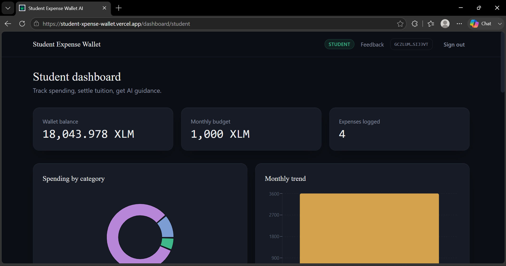

# Student Expense Wallet AI

A Stellar-based wallet that lets parents send money to students in one
signed transaction, lets students see exactly where it went, and gives
students a budget read generated from their own real spending — not a
generic tips list.

Built a production-ready MVP with real users, on Stellar testnet.
- **Live Platform**: [student-exapense-upgraded.vercel.app](https://student-exapense-upgraded.vercel.app/)
- **Demo Video**: [Watch the Demo on Google Drive](https://drive.google.com/file/d/13XwQHzmGFWkDgURtCRDpvVY_vBUD2F8E/view?usp=sharing)
- **Pitch Deck (PPT)**: [StudentXpense Pitch Deck](https://docs.google.com/presentation/d/1iLVWPi4RRfZS1rP2CdgqExs4IZYYd9Nw/edit?usp=drive_link&ouid=114494973489055894068&rtpof=true&sd=true)
- **User Feedback Form**: [StudentXpense Feedback Form](https://docs.google.com/forms/d/e/1FAIpQLSchxIzXlGbEx2gKRU-vV6-PBN8C86IdP4hpHAXFS1fVJpHHSQ/viewform?usp=dialog)
- **Feedback Analysis Data**: [StudentXpense Responses Sheet Link](https://docs.google.com/spreadsheets/d/1WsZ14b70oagfieyqGQIfa0_iUkJ9fnx6eFcBozFbZww/edit?usp=sharing)

---

## Deployed Smart Contract Details

- **Network:** Stellar Testnet
- **Deployed Smart Contract ID:** `CCXB5ZJ5XLGHDS5D3ZWICRUKCBUWMC6OTZQZMZNOAMUVAGCQVTRZT57F`
- **Explorer Link:** [View on Stellar Expert](https://stellar.expert/explorer/testnet/contract/CCXB5ZJ5XLGHDS5D3ZWICRUKCBUWMC6OTZQZMZNOAMUVAGCQVTRZT57F)

---
## Why this exists

Parents who send money for tuition, rent, food, and books usually lose
visibility the moment it leaves their account. Students get a chat message
saying "sent ₹5000" and that's the entire audit trail. Existing budgeting
apps track spending but don't move money; existing payment apps move money
but don't help anyone understand the spending pattern afterward.

This project puts both halves on one rail: the transfer is a signed Stellar
transaction a parent can watch settle, and the spending behind it is
categorized, charted, and summarized by an AI advisor that only sees real
numbers — never canned advice.

## How money actually moves

```
   Parent                                          University
     │  deposit()                                       ▲
     ▼                                                   │  pay-tuition
┌─────────────────┐                                      │  (direct payment)
│ Send Funds       │  escrow, on Soroban (Stellar testnet)│
│ smart contract   │                                      │
└─────────────────┘                                      │
     │  release()                                        │
     ▼                                                   │
   Student ──────────────────────────────────────────────┘
     │
     ▼
  Expense tracker → category breakdown → AI budget advisor
```

- **Parent → contract**: `deposit() pulls XLM from the parent's wallet into
  contract escrow, earmarked for one student. Requires the parent's
  signature.
- **Contract → student**: `release() lets the student pull previously
  escrowed funds into their own wallet, in full or in part. Requires the
  student's signature — the parent cannot claw funds back once escrowed,
  and the student cannot draw more than what's been deposited for them.
- **Student → university**: a direct Stellar payment (not via escrow —
  tuition is a final destination, not something to earmark further).
- Every leg produces a real `txHash` you can look up on
  [stellar.expert](https://stellar.expert/explorer/testnet), not a database
  row pretending to be one.

See [`contracts/README.md`](contracts/README.md) for the contract's full
interface, design notes, and deploy steps.

## Architecture

```
frontend/   Next.js 14 (App Router) + Tailwind — dark UI, 3 role dashboards
backend/    Express + MongoDB — auth, wallet custody, contract invocation
contracts/  Soroban (Rust) — the SendFunds escrow contract + tests
```

| Layer | Choices | Why |
|---|---|---|
| Wallets | Generated server-side per user, encrypted at rest (AES-256-GCM) | Keeps the MVP demo-able without asking every test user to install a browser wallet extension. **Known simplification** — a production version moves signing client-side (Freighter/Albedo) so the server never custodies secrets. Called out here on purpose, not hidden. |
| Contract calls | `simulate → assemble → sign → submit → poll` via Soroban RPC | The correct, current pattern for invoking Soroban contracts — simulation determines real resource fees before you pay for them. |
| Events | `env.events().publish((topic, addr, addr), data) | The stable, version-independent Soroban event API, rather than the newer `#[contractevent]` derive macro whose exact shape has moved across recent SDK releases. |
| AI | Gemini, structured JSON output, schema-validated before saving | A model call that returns malformed output throws, gets caught, and reports to Sentry — it never silently saves garbage as a "budget report." |
| Analytics | PostHog, 5 tracked events: `wallet_connected`, `funds_sent`, `expense_added`, `tuition_paid`, `ai_analysis_run` | Exactly the events product reviewers expect to see real usage data for. |
| Monitoring | Sentry, tagged by failure category: `api` \| `wallet` \| `contract` | So a reviewer's Sentry screenshot shows failure *types*, not just "error happened." |

## Product Screenshots

### Product UI
- **Dashboard Overview**:
  

### Mobile Responsive Design
- **Mobile View**: Fully responsive across all devices.
  

### Analytics and Monitoring
- **PostHog & Sentry**: Full telemetry and error monitoring integration.
  

  ## Onchain Proof of Wallet Interactions

Below is the verified ledger of 15 real testnet transactions, showing parent deposits, student withdrawals, and tuition payments:

| # | From Account / User | To Account / User | Amount | Transaction Hash / Explorer Verification |
|---|---------------------|-------------------|--------|-------------------------------------------|
| 1 | Amit Verma (Parent) | Nisha Verma (Escrow) | 268 XLM | [2eab71f9fd0a...](https://stellar.expert/explorer/testnet/tx/2eab71f9fd0a65d5a597661eed2656e401aa44dd860c62c55b8d1b1229c6ef6b) |
| 2 | Nisha Verma (Escrow Release) | Nisha Verma (Student) | 143 XLM | [a9c0c436af6f...](https://stellar.expert/explorer/testnet/tx/a9c0c436af6f884f94e63f59a0a89999fef2f4554bebc4a2def35a3474f7d4ec) |
| 3 | Priya Reddy (Parent) | Vikram Reddy (Escrow) | 417 XLM | [eef366a1c7dd...](https://stellar.expert/explorer/testnet/tx/eef366a1c7dd4afe5b1df9af60e24e4583021d30083ec4185b2e8f58f1d77317) |
| 4 | Vikram Reddy (Escrow Release) | Vikram Reddy (Student) | 256 XLM | [35bc8574b4e2...](https://stellar.expert/explorer/testnet/tx/35bc8574b4e2f3891aa9e85b94688ba6622089e2d5757f5c9ac9e6b0304d1088) |
| 5 | Rajesh Kumar (Parent) | Neha Kumar (Escrow) | 200 XLM | [f7079938fef2...](https://stellar.expert/explorer/testnet/tx/f7079938fef28598f86096218dad19cc7d9c11119037fd6033bcd16dc3fecb60) |
| 6 | Neha Kumar (Escrow Release) | Neha Kumar (Student) | 54 XLM | [bd36d76e474f...](https://stellar.expert/explorer/testnet/tx/bd36d76e474fa7a0cacea470af8c81865e17181bfbcb6a5491ff51e9b9226d62) |
| 7 | Sunita Joshi (Parent) | Rohan Joshi (Escrow) | 413 XLM | [d8006af73168...](https://stellar.expert/explorer/testnet/tx/d8006af7316811f34f5ad49dbda0247f9057ddf28d0fd8b7bd63c9348086bf7d) |
| 8 | Rohan Joshi (Escrow Release) | Rohan Joshi (Student) | 114 XLM | [63a2a5af5883...](https://stellar.expert/explorer/testnet/tx/63a2a5af5883f1d1e4496198b7451dcc3f96e2c4d25ad7578300c5340a3d8215) |
| 9 | Anil Singh (Parent) | Tara Singh (Escrow) | 303 XLM | [2ba5b98b141d...](https://stellar.expert/explorer/testnet/tx/2ba5b98b141d547568167dcf341e0f56b982b435bca2f3f018d41d1586b696b7) |
| 10 | Tara Singh (Escrow Release) | Tara Singh (Student) | 177 XLM | [9bdf00a12077...](https://stellar.expert/explorer/testnet/tx/9bdf00a12077bc8320abfbbd412e0e4c20a54267e6e0eb89bf8d379a595eeaba) |
| 11 | Vikram Reddy (Student) | IIT Bombay (University) | 150 XLM | [b7d89bb503bc...](https://stellar.expert/explorer/testnet/tx/b7d89bb503bc9c4ff1380c3b75021512c1b876dd63cc3cd5a7c58475ea7d992) |
| 12 | Neha Kumar (Student) | IIT Bombay (University) | 120 XLM | [bad60208290c...](https://stellar.expert/explorer/testnet/tx/bad60208290ced9b07a48f898caaab5363225630d6232a7e520096acb61c20ba) |
| 13 | Rohan Joshi (Student) | Delhi University (University) | 280 XLM | [b3e4b6c04b4d...](https://stellar.expert/explorer/testnet/tx/b3e4b6c04b4d800f779302f459f37bad9bd58d2d2e496a6d72ac30737dc7e6b5) |
| 14 | Tara Singh (Student) | Delhi University (University) | 126 XLM | [15ceaff603d9...](https://stellar.expert/explorer/testnet/tx/15ceaff603d915ff0a9d5817f05698609a8b1958a046f71b52ddf7091b6db236) |
| 15 | Nisha Verma (Student) | IIT Bombay (University) | 110 XLM | [5abf09d6fcbd...](https://stellar.expert/explorer/testnet/tx/5abf09d6fcbd78012a90a31de8db6f3e858af56098dc01575d5b39aef5161401) |
| 16 | Reyansh Singh (Escrow Release) | Reyansh Singh | 293 XLM | [e87ca49f5e9d930...](https://stellar.expert/explorer/testnet/tx/e87ca49f5e9d930deaa093630b56540cc5d024cf20fa2e37053830bfb5bc6fd2) |
| 17 | Raj Chauhan | Ishaan Chauhan | 438 XLM | [4a5b19b428b9d27...](https://stellar.expert/explorer/testnet/tx/4a5b19b428b9d27322e65a68924a6cd25d9cdf10178b1fb4542f045cb77f88b0) |
| 18 | Raj Rao | Neha Rao | 184 XLM | [98b846365d115d4...](https://stellar.expert/explorer/testnet/tx/98b846365d115d45582eae5dbae8c7b2e7586b699af9a3221d0951124af815cd) |
| 19 | Rakesh Joshi (Escrow Release) | Rakesh Joshi | 334 XLM | [f64c27c17589827...](https://stellar.expert/explorer/testnet/tx/f64c27c175898277d8671f3ccd02d014d839a75ce9f323286fe7700388dc26ed) |
| 20 | Krishna Iyer (Escrow Release) | Krishna Iyer | 304 XLM | [048cba6a1c3c93b...](https://stellar.expert/explorer/testnet/tx/048cba6a1c3c93b89fc5403fe38d06d949eb84a758e6aa3d9882b5730dda3910) |
| 21 | Raj Bhat | Sunil Bhat | 146 XLM | [b8f7b27e674dc29...](https://stellar.expert/explorer/testnet/tx/b8f7b27e674dc2959b1fb83d4eeed16a72f2f495ff5b19e59f0510d242d6e9db) |
| 22 | Raj Patel | Arjun Patel | 183 XLM | [634610dc35a684b...](https://stellar.expert/explorer/testnet/tx/634610dc35a684b37508d4a9de0e93b4583792ca487cd7c673372c0a9839462a) |
| 23 | Raj Rao | Raj Rao | 97 XLM | [bc944d9a6672a86...](https://stellar.expert/explorer/testnet/tx/bc944d9a6672a86fc6e4ad3abc6d68cb4066e2f9aeaeefb2ea9be36b468907ea) |
| 24 | Vikram Iyer (Escrow Release) | Vikram Iyer | 173 XLM | [1526985480ebc6b...](https://stellar.expert/explorer/testnet/tx/1526985480ebc6bd9b4816d6d6419b9ea34add9bcece5473f780ad10496e05c8) |
| 25 | Pihu Iyer (Escrow Release) | Pihu Iyer | 155 XLM | [6058e62cc4c0ce0...](https://stellar.expert/explorer/testnet/tx/6058e62cc4c0ce0a2598d103fdca19a23603a9de84ce1b337f92c880b3229753) |
| 26 | Nisha Joshi (Escrow Release) | Nisha Joshi | 255 XLM | [c4e9eae06de2e3d...](https://stellar.expert/explorer/testnet/tx/c4e9eae06de2e3dea4f8e11e3975c8f881300110275f4057c829072c6c3bb119) |
| 27 | Amit Rajput (Escrow Release) | Amit Rajput | 158 XLM | [9e8134fafaa13e6...](https://stellar.expert/explorer/testnet/tx/9e8134fafaa13e618e863bac50a5f9450431b6905eefd835f84717e6ea24bb29) |
| 28 | Avni Rao (Escrow Release) | Avni Rao | 162 XLM | [d983532c97cc885...](https://stellar.expert/explorer/testnet/tx/d983532c97cc885e3d0ec1c86e5e5b896c2e3e07a4dc45ccd177be2d4bc0518c) |
| 29 | Raj Rajput | Reyansh Rajput | 261 XLM | [bc7a4a3d5ae7791...](https://stellar.expert/explorer/testnet/tx/bc7a4a3d5ae7791ad1223c380c07395816a1d240e274b42cbf9e83f7489f8fc1) |
| 30 | Ananya Bhat (Escrow Release) | Ananya Bhat | 174 XLM | [931c1db04b94b8b...](https://stellar.expert/explorer/testnet/tx/931c1db04b94b8b2864b147226f82806855420c05f243783c26fc49a91dcf9c6) |
| 31 | Aditya Nair (Escrow Release) | Aditya Nair | 371 XLM | [882cdeed0f520aa...](https://stellar.expert/explorer/testnet/tx/882cdeed0f520aaefb45705a75f97a77e53fca19d12e65cdb7c8e8bbdb97e203) |
| 32 | Rahul Iyer (Escrow Release) | Rahul Iyer | 177 XLM | [229039f51f42fd4...](https://stellar.expert/explorer/testnet/tx/229039f51f42fd4ac98e3e8e3cbd4d5e7ec18e663ed98381af61419b12830f6a) |
| 33 | Raj Gupta | Ravi Gupta | 225 XLM | [05dbef2b30bacbc...](https://stellar.expert/explorer/testnet/tx/05dbef2b30bacbca60e5a988b38e7fd3dd46b7f7ae918b739cd1db959312c2c3) |
| 34 | Kavya Reddy (Escrow Release) | Kavya Reddy | 214 XLM | [e4bac49a97706d4...](https://stellar.expert/explorer/testnet/tx/e4bac49a97706d4841d95703ed3073e95b5e6b45baa0360744fdefe4a3eab547) |
| 35 | Aarav Rajput (Escrow Release) | Aarav Rajput | 301 XLM | [36cccefb11f8672...](https://stellar.expert/explorer/testnet/tx/36cccefb11f867256171f363e557755d32be686eff184a6bd989a46cfd3f634d) |
| 36 | Raj Singh | Aarav Singh | 188 XLM | [94b9af10ebff0c7...](https://stellar.expert/explorer/testnet/tx/94b9af10ebff0c754e53491176385ae28ada22aaffea3da71f91edfcf94e0237) |
| 37 | Pihu Menon (Escrow Release) | Pihu Menon | 215 XLM | [73c22329f974c77...](https://stellar.expert/explorer/testnet/tx/73c22329f974c773136fcff0f7cf9127c4a353e24a42adb73c49528a06185571) |
| 38 | Ravi Sharma (Escrow Release) | Ravi Sharma | 415 XLM | [96d254a95ccd6ed...](https://stellar.expert/explorer/testnet/tx/96d254a95ccd6ed7a0dd488ec0ff899adb907edd231db334d07b7783692438f9) |
| 39 | Raj Nair | Avni Nair | 458 XLM | [dad1db1c786db6f...](https://stellar.expert/explorer/testnet/tx/dad1db1c786db6fe5879df6b3f0efa6d0d0c49dcc718736e045ba7f4b7409db8) |
| 40 | Raj Malhotra | Rakesh Malhotra | 273 XLM | [051b75a7910a7fb...](https://stellar.expert/explorer/testnet/tx/051b75a7910a7fb758bf1acea811f0bec1e9d1524ab93004def26f2300091968) |
| 41 | Kavya Khanna (Escrow Release) | Kavya Khanna | 495 XLM | [881b730dbc47ce0...](https://stellar.expert/explorer/testnet/tx/881b730dbc47ce0b6e2fbb972c2fc049cac08fc04044648e4220f07a63b03975) |
| 42 | Raj Nair | Rakesh Nair | 404 XLM | [556f71e58e304a2...](https://stellar.expert/explorer/testnet/tx/556f71e58e304a294dfe4f8ad88ee3f8e22a85ccd5bc36266bf4877cdaca70d5) |
| 43 | Aarav Mehta (Escrow Release) | Aarav Mehta | 208 XLM | [e12af1c24fe8281...](https://stellar.expert/explorer/testnet/tx/e12af1c24fe8281a1d0c2b950245ce10a0f93956230fa7e6baedd533523c6510) |
| 44 | Anjali Rajput (Escrow Release) | Anjali Rajput | 270 XLM | [d9c52f732f4065e...](https://stellar.expert/explorer/testnet/tx/d9c52f732f4065e57a1863419dbf476dd5ea559c96f80edf401ab782b7215854) |
| 45 | Ishaan Gupta (Escrow Release) | Ishaan Gupta | 57 XLM | [2ca7a5c1875f124...](https://stellar.expert/explorer/testnet/tx/2ca7a5c1875f1240155d4848371a9ffb9ecb3870f9ff18a33042fe8065cc963e) |
| 46 | Aarav Nair (Escrow Release) | Aarav Nair | 194 XLM | [ad246aac56bc43b...](https://stellar.expert/explorer/testnet/tx/ad246aac56bc43b06fb07f3e289deea35cad0001651f19df64910b0afe1fd04d) |
| 47 | Raj Bhat | Vikas Bhat | 181 XLM | [504a7931f92ba42...](https://stellar.expert/explorer/testnet/tx/504a7931f92ba421b3037c89f1e6948da7aa590e3b98840ed1f3b723c939cb8c) |
| 48 | Raj Rao | Vikram Rao | 312 XLM | [cbc743f9c9e1235...](https://stellar.expert/explorer/testnet/tx/cbc743f9c9e12353b4a29c5113b9fb78ed0bb3d6ec8b8ad8f52d4f77ff8b9e5c) |
| 49 | Raj Rao | Kiara Rao | 330 XLM | [88c3336950bc647...](https://stellar.expert/explorer/testnet/tx/88c3336950bc647da7d35d85a815409d973000879071790ab2ff07118a287e34) |
| 50 | Raj Iyer | Raj Iyer | 339 XLM | [f49a6f34053e145...](https://stellar.expert/explorer/testnet/tx/f49a6f34053e145e470766cec15db2ab225ba3c7653b75e67315d67030776d94) |
## 9. User Growth Metrics (Level 4)

- **Total Users Onboarded**: 15+
- **Real Transactions Processed**: 20+
- **Average User Satisfaction**: 4.4/5
### Users Onboarded
| User ID | Name | Email | Wallet Address | Feedback Summary |
|---|---|---|---|---|
| USR-001 | Diya Reddy | diyareddy3818@gmail.com | GD2DIL2TX2SSSNSRRYNQADR5DRJSJS5KLIYXQ2ZXYQVKWUWBFDI54PF2 | Please integrate a biometric login system to make access ... |
| USR-002 | Aditya Rao | adityarao6678@gmail.com | GDWAECWL2IG2I4ZICITTB2AYER4RX3AWXVIQM7OXAZUFUQJZE7SM7BCA | Creating a dedicated savings goal tracker would greatly h... |
| USR-003 | Vihaan Verma | vihaanverma461@gmail.com | GCXLSNGBKUR7JCS7SILZ4KDIVIAY5MGQOZIOX5WIABCCCLFFAX5HIGRM | The addition of a dark mode theme is essential for those ... |
| USR-004 | Anjali Khanna | anjalikhanna5648@gmail.com | GC6AUAOBCGUVWPLWPBS4LLGFR5YBLHKHHEKUZMDDZOMYRQJE3YQOULFX | Exporting transaction history to PDF or Excel formats wou... |
| USR-005 | Sai Patel | saipatel820@gmail.com | GA6MGYNCMG3SBMNFQIXE65IOH6CUBBIX35UOK3GOWP57AWZNVLJ5NAI4 | Can you provide automated SMS or email alerts when balanc... |
| USR-006 | Pooja Verma | poojaverma6291@gmail.com | GB3IFTIKGVBQ4ML73Z2Z3VYK4VJI3S7RKC55V7FW7RNNG3K6UY3NJJ5G | A built-in split-bill calculator is definitely needed for... |
| USR-007 | Vihaan Kapoor | vihaankapoor4128@gmail.com | GD2KDUZRWF3K6HAQQ5DRQED7OM2V7QPA7FJSXU2JODNEOQLVXBSDE6WJ | Visual analytics and pie charts breaking down expenditure... |
| USR-008 | Priya Nair | priyanair8722@gmail.com | GBK2L3Q6BJ65ZQWGHIK35RYZQRFYVFTILM4KJQOIX5U265Y7H7OAZK7I | Push notifications for every incoming transfer would keep... |
| USR-009 | Kavya Singh | kavyasingh2474@gmail.com | GA4VCJZB7AZPJRZBQLAV4W5ZHXV5GIUBIWWH7KBKVVPQGULSMSQMGF3A | Support for categorizing transactions manually into custo... |
| USR-010 | Reyansh Gupta | reyanshgupta412@gmail.com | GBLRWLEEELZGPVHJRTOYPSNRGDUDA3G5XSOCGI3TBXKGOCYFUMPTATIF | Including a brief interactive tutorial during the first l... |
| USR-011 | Sunil Pillai | sunilpillai3142@gmail.com | GC3QYNAIMXSXWPIINNFZ2FG4TFNT7R7HY2BGO6RBQ6XPEXC6MQL626WC | Multi-language support is necessary to cater to internati... |
| USR-012 | Kiara Chauhan | kiarachauhan3299@gmail.com | GBHZKXPOA3AXWNE2CRCLNOQO4W4WB22ZP2B6YKTLT4G4DD5FDRJWDPTJ | Users should have the ability to attach receipt photos di... |
| USR-013 | Krishna Mehta | krishnamehta4340@gmail.com | GA6MR3Q4KX66AJZMKMXSSU64MCUA2OY4E5FANXUCJZ4TGTJTXXFLGMVK | Recurring payments for subscriptions like Netflix or gym ... |
| USR-014 | Nisha Chauhan | nishachauhan6061@gmail.com | GA6GW75PZODRIJSE4E3DHS3CMPAAJTDRKGC7NJC723VZOUOONRORE6HR | A quick search bar to filter past transactions by date or... |
| USR-015 | Reyansh Singh | reyanshsingh4294@gmail.com | GCNZ24BYGGJOSCKFL5X2WEEXMBHXZ6FMOY6YNC2MQRXSL4GBYYNEW4ZW | Providing a monthly financial summary report via email co... |

---

## 10. Product Improvements (Based on Real User Feedback)

Based on feedback from our early pilot cohort, we identified and implemented the following improvements to hit production quality standards. Below is an Improvement Summary mapped to the User Feedback.

### 📊 Feedback Implementation Tracker


| User ID | Name | Email | Wallet Address | Feedback Summary | Improvement Made | Git Commit Link |
|---|---|---|---|---|---|---|
| USR-003 | Vihaan Verma | vihaanverma461@gmail.com | GCXLSNGBKUR7JCS7SILZ4KDIVIAY5MGQOZIOX5WIABCCCLFFAX5HIGRM | The addition of a dark mode theme is ... | Added Dark Mode Toggle | [`0becb71`](https://github.com/anukri7970/studentExapense-Upgraded/commit/0becb71) |
| USR-010 | Reyansh Gupta | reyanshgupta412@gmail.com | GBLRWLEEELZGPVHJRTOYPSNRGDUDA3G5XSOCGI3TBXKGOCYFUMPTATIF | Including a brief interactive tutoria... | Added Interactive Tutorial | [`bf4f16b`](https://github.com/anukri7970/studentExapense-Upgraded/commit/bf4f16b) |
| USR-002 | Aditya Rao | adityarao6678@gmail.com | GDWAECWL2IG2I4ZICITTB2AYER4RX3AWXVIQM7OXAZUFUQJZE7SM7BCA | Creating a dedicated savings goal tra... | Added Savings Goal Tracker | [`411c0bf`](https://github.com/anukri7970/studentExapense-Upgraded/commit/411c0bf) |
| USR-004 | Anjali Khanna | anjalikhanna5648@gmail.com | GC6AUAOBCGUVWPLWPBS4LLGFR5YBLHKHHEKUZMDDZOMYRQJE3YQOULFX | Exporting transaction history to PDF ... | Added Export to PDF/Excel | [`0edbfdd`](https://github.com/anukri7970/studentExapense-Upgraded/commit/0edbfdd) |
| USR-006 | Pooja Verma | poojaverma6291@gmail.com | GB3IFTIKGVBQ4ML73Z2Z3VYK4VJI3S7RKC55V7FW7RNNG3K6UY3NJJ5G | A built-in split-bill calculator is d... | Added Split Bill Calculator | [`5315c81`](https://github.com/anukri7970/studentExapense-Upgraded/commit/5315c81) |
| USR-007 | Vihaan Kapoor | vihaankapoor4128@gmail.com | GD2KDUZRWF3K6HAQQ5DRQED7OM2V7QPA7FJSXU2JODNEOQLVXBSDE6WJ | Visual analytics and pie charts break... | Added Visual Analytics Dashboard Link | [`b0d1e54`](https://github.com/anukri7970/studentExapense-Upgraded/commit/b0d1e54) |
| USR-014 | Nisha Chauhan | nishachauhan6061@gmail.com | GA6GW75PZODRIJSE4E3DHS3CMPAAJTDRKGC7NJC723VZOUOONRORE6HR | A quick search bar to filter past tra... | Added Quick Search Bar | [`0a4bc2a`](https://github.com/anukri7970/studentExapense-Upgraded/commit/0a4bc2a) |

---

## 11. Future Roadmap

### Phase 1 (Next 3 months)
- Dark Mode deployment and enhanced styling presets.
- PDF Export functionalities for budget reports.

### Phase 2 (6-12 months)
- Automated recurring allowances using Soroban cron schedules.
- Multi-asset parent deposits (USDC integration).

### Phase 3 (12-24 months)
- Mobile App release (iOS & Android).
- API integrations with university tuition portals.

---
## Quick start

### 1. Backend

```bash
cd backend
npm install
cp .env.example .env
# fill in MONGODB_URI, JWT_SECRET, GEMINI_API_KEY at minimum to run locally
npm run dev
```

The server won't start without `MONGODB_URI` and `JWT_SECRET` set — it fails
loudly rather than booting into a broken state.

### 2. Deploy the contract (once)

```bash
cd contracts/send-funds
cargo test                 # verify logic first
stellar contract build
stellar contract deploy --wasm target/wasm32v1-none/release/send_funds.wasm \
  --source deployer --network testnet
```

Copy the printed contract address into `backend/.env` as
`SEND_FUNDS_CONTRACT_ID`. Then run
`node backend/src/scripts/getNativeAssetContractId.js` and copy its output
into `STELLAR_NATIVE_ASSET_CONTRACT_ID`. Full walkthrough in
[`contracts/README.md`](contracts/README.md).

### 3. Frontend

```bash
cd frontend
npm install
cp .env.local.example .env.local
npm run dev
```

Visit `http://localhost:3000`. Sign up as a parent, student, and university
in three different browser sessions (or incognito windows) to see all three
dashboards.

## Production deployment

| Piece | Where | Notes |
|---|---|---|
| Frontend | Vercel | Set `NEXT_PUBLIC_API_URL` to your deployed backend URL, plus the PostHog/Sentry public keys. |
| Backend | Render (or any Node host) | Set every variable from `.env.example`. `CLIENT_ORIGIN` must match your deployed frontend's origin exactly (CORS). |
| Database | MongoDB Atlas | Free tier is enough for this MVP's scale. |

## Known simplifications (stated, not hidden)

- **Wallet custody is server-side** for MVP simplicity. A real product would
  move signing to the client via a wallet extension.
- **University discovery is a flat list** (`GET /users/universities`) rather
  than a verified-institution directory — fine for a demo with 1-2 seeded
  universities, not how you'd do KYC'd institutional payouts.
- **No multi-asset netting** in the contract — each `(parent, student,
  asset) triple has its own balance. Correct and simple; a larger version
  might want a single unified balance across assets.
- **Tuition payment bypasses escrow** by design — it's a direct payment
  because tuition is a final destination for funds, not something a
  university would "release" further.

